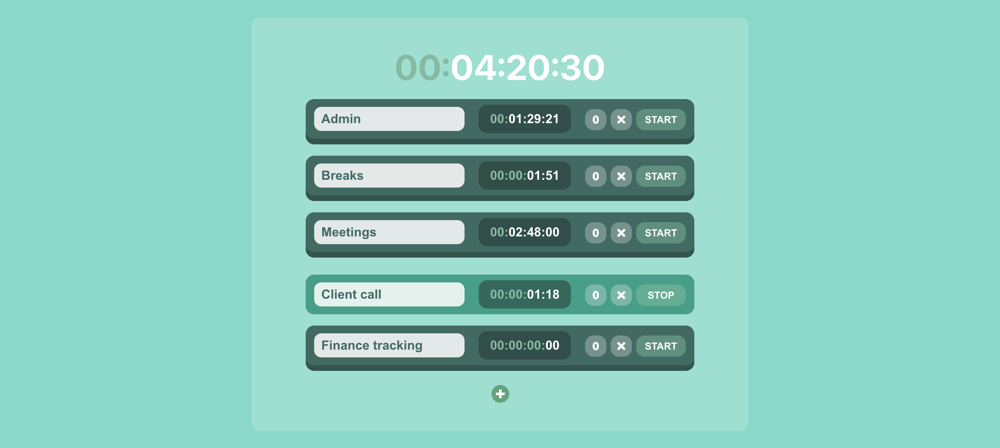

## Introduction

**Switchwatch aims to empower users to track their time spent working on multiple tasks, and to switch between individual tasks instantly.**

When I worked as an account handler in healthcare advertising, I would often have about 10 tasks to complete every day, each with time billable to a different client. I would also have to factor in breaks, office admin, meetings and client calls, which sometimes begun without warning. It was very hard to accurately track the time I spent on all these tasks, and I would spend a lot of time estimating my timesheets at the end of the day. This web-app has been created to help with this problem.

This project was bootstrapped with [Create React App](https://github.com/facebook/create-react-app).

## Access

This project in a work-in-progress. It is not currently hosted online. To use this through a local host:

1. Fork this repository and clone to a local repository
2. Open the root directory and, from the command-line, run `npm start` to view in browser

## Interaction

The following interactivity is included:

1. When first opened, two task boxes will appear by default: Admin and Breaks. Each task has a name field, a timer, and the following buttons: `0`, `x` and `START`/`STOP`
2. Click `START` to begin running the timer on one of these tasks. You can click `START` on another task to switch to that, or `STOP` to stop the timer. The total time for all tasks is shown at the top of the page
3. You can edit any task's name by clicking and retyping the task's name field
4. Click `0` to reset a task's timer to 0
5. Click `x` to hide a task. Hidden tasks will not be included in the total time
6. To add more tasks, click the green `+` button at the bottom of the page
7. When a task is hidden, two more buttons will appear at the bottom of the page: a `bin` and an `undo` button. The `bin` button will permanently delete any hidden tasks. The `undo` button will unhide the most recently hidden task

## Technologies

- [React](https://reactjs.org/)

## Resources

I used the following resources to learn about implementing specific functionality into this web-app:

1. I learned how to create a simple stomwatch with this tutorial: [How to Build a Stopwatch Timer using React Hooks](https://www.youtube.com/watch?v=sSWGdj8a5Fs&ab_channel=CodeBoost)
2. 3D button design: [Building a Magical 3D Button](https://www.joshwcomeau.com/animation/3d-button/)
3. Conditional CSS: [Applying Classes Conditionally in React](https://www.pluralsight.com/guides/applying-classes-conditionally-react)
